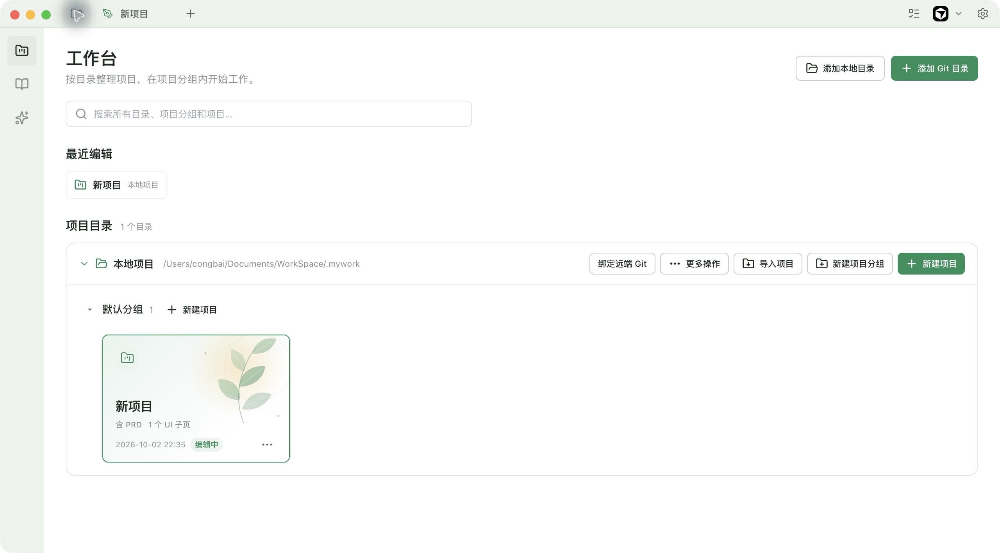
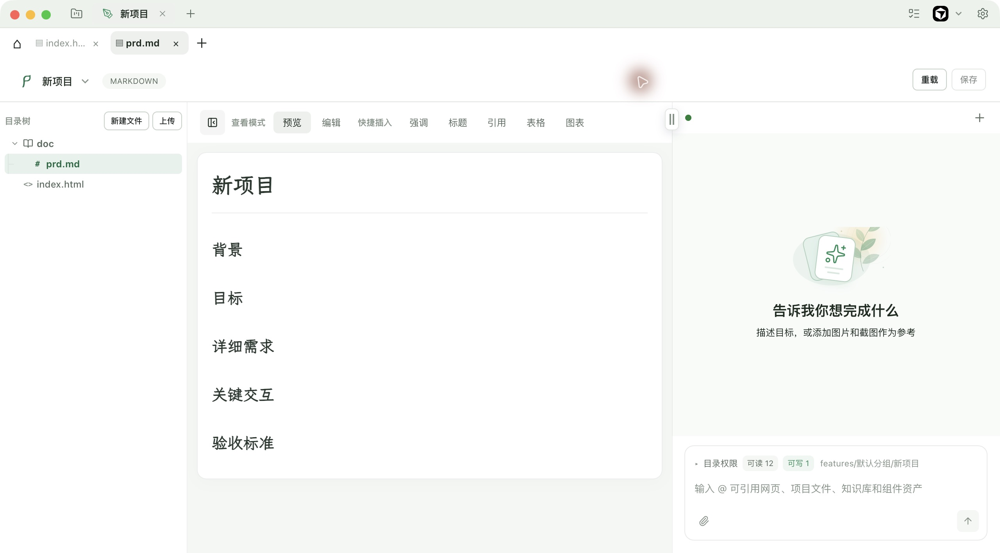
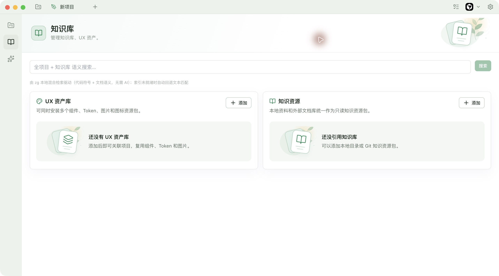
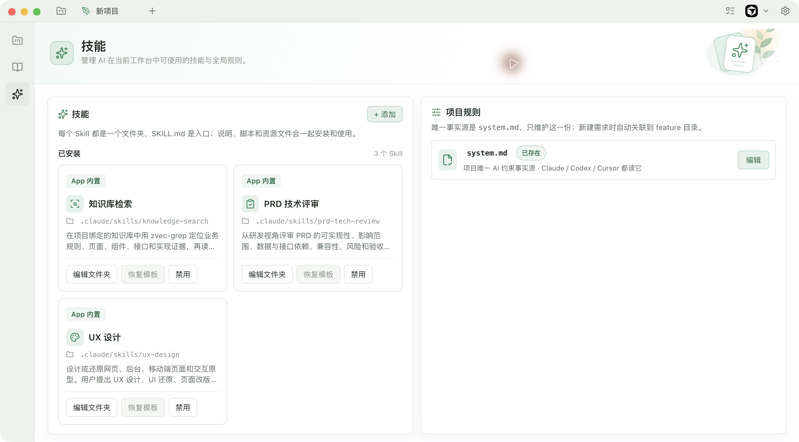

<p align="center">
  
</p>

<h1 align="center">Plant</h1>
<p align="center"><strong>基于 Git，以最小成本让产品与设计资产 AI Native 化。</strong></p>
<p align="center">面向 PM、UX 与小团队的桌面 AI 工作台 · 让想法生长为界面</p>



## AI 已经进入研发，产品与设计资产也应该跟上

代码天然是 AI 容易读取的文件，并且有 Git 管理版本。但 PM 和 UX 的日常资产往往散落在文档平台、设计工具、聊天记录与个人文件夹中。AI 能帮忙写一段需求、画一个页面，却很难持续使用团队真正的业务背景、组件规范和历史决策。

我们观察到，这道门槛经常来自技术：产品经理与设计师知道哪些资料有价值，却未必知道怎样组织上下文、维护检索索引、配置 Agent，或把设计规范转为可执行的样式。每次对话重新解释一遍背景，成果仍然难以复用。

**Plant 用本地文件与 Git 连接这两端：让 PM 和 UX 可以整理、选择、检索和编辑资产，让 AI 在这些资产上工作，再把结果留回团队可以管理的仓库。**

这里的 AI Native，指资产能被 AI 定位、读取、引用并持续更新，而不只是附在一次聊天里的附件。需求有原文，设计有 Token 和样式，产出有版本，研发可以继续使用同一份上下文。

## 最小成本，来自复用团队已有的 Git

一个本地目录就可以开始；需要协作时，连接已有的 Git 仓库。团队不必先搭建专门的 AI 协作后端，也不必把资料迁移到一套专有格式。

| 已有基础 | 在 Plant 中的用途 |
| --- | --- |
| 文档与代码仓库 | 成为可关联、可检索的业务知识库 |
| 设计规范与组件资产 | 成为带规则、Token、CSS 和示例的 UX 知识库 |
| Git 版本与同步 | 记录需求、原型、规范的变化，共享经过确认的成果 |
| 已有 AI 工具或模型服务 | 按任务选择引擎，继续使用自己的配置与账号 |

“最小成本”是降低接入和维护成本：复用文件、仓库与现有工具。模型调用和 Git 托管仍按所选服务计费。

一个典型闭环是：**整理业务与设计资产 → 按项目关联 → 对话选择上下文 → 编写需求、生成界面 → 预览编辑 → Git 同步 → 研发继续使用。**

## 对话时，明确选择 AI 应该参考什么



不是每个任务都需要整个仓库。Plant 的 AI 输入面板支持通过 `@` 引用项目文件、网页、知识库和组件资产，也能附加截图或参考图。你可以将“一份会员规则、一套设计模板、当前页面”组合成一次任务的上下文，减少反复复制和解释。

输入面板同时展示目录访问范围，帮助你理解本次任务关联的资源。关联知识库提供可检索的资料入口，具体任务再按需查找和读取原文。

> 参考会员业务知识库与 Ant Design 设计模板，为会员管理编写 PRD。沿用团队主色和表单规范，生成一个可预览的页面，覆盖空数据、加载和错误状态。

## 检索先找到依据，再让 AI 阅读



Plant 使用本地 **zvec-grep 混合检索**，结合文本匹配、BM25 与向量检索，兼顾字段名、组件名等精确线索，以及用自然语言描述的业务问题。检索定位相关文件与片段，再读取原始资料，减少重复扫描和将整库塞进对话的开销。

索引支持按内容哈希增量构建，重复构建请求会排队并去重；你可以查看构建状态、手动重建，Git 更新后也会触发索引更新。索引不可用时，搜索回退到文本匹配。首次语义索引可能需要下载模型并等待向量补齐。

我们优化的是资料定位与上下文准备流程，目前没有公开的速度基准或倍数承诺。

## 设计模板，比一份 Skill 多一套可用的设计依据

Skill 适合告诉 AI “按什么步骤做”；稳定的界面还需要回答“使用什么颜色、圆角、组件和状态”。Plant 的 UX 知识库让这些内容放在一起、一起检索，并通过 Git 共同维护。

| 内容 | 对 AI 设计的作用 |
| --- | --- |
| Skill 与 `AI_USAGE.md` | 指定工作流程、资源入口与复用约束 |
| 设计规范 | 解释信息层级、布局、交互与组件使用方式 |
| 实际 Token 与 CSS | 提供颜色、字体、间距、圆角、亮暗主题的具体值 |
| 组件源码、示例、图片与图标 | 给出可复用的实现与视觉依据 |
| Git 版本 | 让团队确认规范变更，并追溯某次设计参考的资产 |

**设计模板是“流程 + 规范 + 样式 + 资产”的组合。** 相比只有文字指令的 Skill，它提供更多可执行、可检查的约束，帮助 AI 沿用团队的设计语言。实际质量仍需要预览与审阅。

### 从 Ant Design 或 HeroUI 开始

仓库提供两套[UX 知识库起步模板](resources/design-templates/README.md)，资料取自官方文档与源码，并保留固定提交和许可证：

- **[Ant Design](resources/design-templates/antd/design-guide.md)**：官方 Seed Token 源码、Seed → Map → Alias 主题机制说明、设计原则与组件规范入口，以及团队主题 JSON 和 HTML 用 CSS Token 示例。React 项目通过 `ConfigProvider` 应用主题。
- **[HeroUI v3](resources/design-templates/heroui/design-guide.md)**：官方亮暗主题变量、真实 Button CSS、组件与主题说明，以及团队定制的 CSS 覆盖示例。React 实现使用 Tailwind v4 与 `@heroui/styles`。

Ant Design 和 HeroUI 默认填充在「知识库 → UX 资产库」的资产列表中，包含可识别的主题、按钮预览及写法说明。「查看文件」可阅读源码、复制到本地定制；「关联项目」后可打开资产预览，并在对话中选择。用户可补上自己的品牌色、组件与页面范例，也可以提交到团队 Git 仓库。模板中的 Skill 可单独安装。

v0.2.13 已包含这两套默认 UI 资产。它们是设计参考与起步资产，不会自动安装 Ant Design 或 HeroUI，也不意味着 Plant 自身采用了这两个组件库。官方源码的构建要求与 HTML 原型的边界见[模板说明](resources/design-templates/README.md)。

## 从需求到界面，在可见的面板中完成

项目编辑器把文件、产出与对话放在一起：

- **需求写作**：Markdown 编辑与预览，使用霞鹜文楷呈现正文，结合业务资料编写 PRD 与进行技术评审。
- **界面设计**：HTML 源码与预览、桌面和移动端画布、页面元素选择；针对选中的元素描述修改目标。
- **迭代交付**：检查页面与文件，继续手动编辑或让 AI 调整，保存后通过变更记录与 Git 同步共享。

AI 的结果可以直接查看和继续修改，最终留下普通 Markdown、HTML 与辅助文件，便于研发阅读和复用。

## 工作台，容纳多个产品和目录

层级是 **工作台 → 目录 → 项目分组 → 项目**。目录可以是本地文件夹或 Git 仓库，也可以选择 Git 仓库中的子目录作为入口。

默认本地目录让你打开即可创建项目；支持多个目录、可折叠的目录与分组、顶部全局搜索，以及紧凑的最近编辑入口。没有分组时使用默认分组，新建项目后直接进入编辑器。解绑目录保留文件和历史。

项目采用约定结构：

```text
目录入口/
└── features/
    └── 项目分组/
        └── 项目/
            ├── index.html       # 可预览的界面原型
            └── doc/
                └── prd.md       # 产品需求
```

产品与设计成员在资产仓库维护成果，研发直接读取，或将仓库作为 Git submodule 引入应用项目，使编码助手使用同一份需求与设计依据。下游 submodule 的配置与版本更新由研发团队管理。

## 让团队的方法和工具继续积累



内置知识库检索、PRD 技术评审和 UX 设计技能，支持安装、编辑、启停 Skill，以及共享 `system.md` 规则。方法留在 Skill 中，业务和设计依据留在知识库中，成果留在项目中。

内置 Plant 助手集成 DeepSeek 官方 Harness，可配置服务地址、协议、模型与 API Key，无需另外安装 dsh；当前集成为 `0.2.0-rc.2` 预发布版。也支持本机 Claude Code、Codex CLI、OpenCode CLI 与 Pi CLI，需要自行安装及认证。各引擎分别保存对话历史，切换对下一条消息生效。

内嵌终端、外部 IDE、浅深主题与按需开启的任务悬浮球，让团队沿用已有的工作习惯。

## 数据与运行方式

项目文件和知识库索引保存在本地。使用 AI 时，任务内容及所引用的上下文会发送到你配置的模型服务；本地 CLI 使用各自的认证与运行配置。API Key 在本地加密保存，并在界面中以掩码提示已保存状态。

使用本地项目无需 Git 托管服务；使用远程协作或 AI 时，需要相应的仓库访问权限与模型服务配置。

## 下载与安装

[下载预览版 v0.2.13](https://github.com/percentcola3/plant/releases/tag/v0.2.13) · [直接下载 macOS Apple Silicon 安装包](https://github.com/percentcola3/plant/releases/download/v0.2.13/Plant-0.2.13-arm64.dmg)

当前提供 macOS arm64（Apple Silicon）DMG。打开安装包后，将 Plant 拖入 Applications。此预览版尚未签名与公证，macOS 可能阻止首次启动；请按系统提示在“隐私与安全性”中确认允许打开。

截图更新于 2026-10-02，展示当前版本的工作台、Markdown 编辑器、知识库和技能管理。本版验证结果与已知限制见 [发布验证记录](docs/release-validation-v0.2.13.md)。

## 本地开发

Plant 基于 Electron、Vue 3 和 TypeScript，当前打包目标为 **macOS arm64**。开发需要 Node.js、pnpm，以及 `node-pty` 等原生模块所需的构建工具。

```sh
pnpm install            # 安装依赖并重建原生模块
pnpm dev                # 启动桌面应用
pnpm build              # 构建应用
pnpm test               # 运行测试
pnpm typecheck          # 检查类型
pnpm setup:bundled-git  # 准备打包使用的 Git
pnpm pack:dir           # 生成未签名的本地应用包
```

核心组件包括 Pinia、CodeMirror、xterm、node-pty、dugite、zvec-grep 和 DeepSeek Harness。仓库同时维护 npm 与 pnpm 锁文件；依赖变更时应保持两者一致，dsh 相关包应使用相同版本。

品牌标志与图标生成方式见 [Plant 品牌资源](resources/brand/README.md)。
