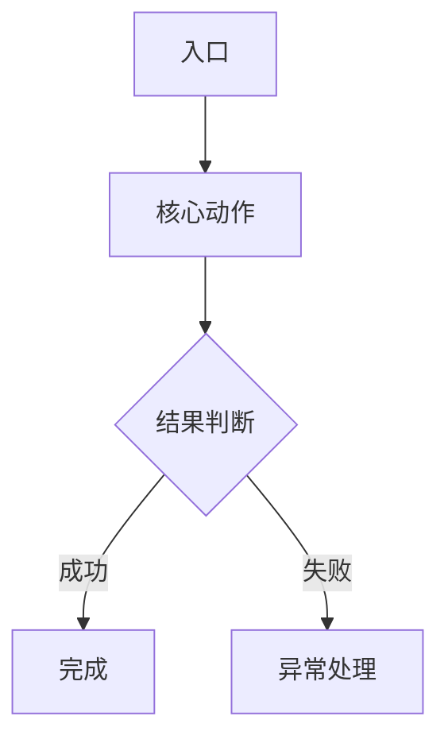
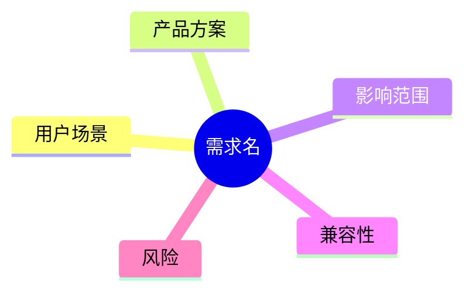

# PRD 模板

> `pm-prd` skill 模式 A（写 PRD）的产出格式。每个段都给了空骨架，**不是营销文档**——能被研发 / QA / 产品评审都直接读懂为目标。

````markdown
# <需求名> PRD

## 1. 背景与目标
- 背景：
- 目标：
- 非目标：

## 1.1 术语说明
| 术语 | 说明 | 是否已确认 |
|---|---|---|
| | | 是/否 |

## 2. 用户与场景
- 目标用户：
- 触发场景：
- 核心路径：

## 3. 需求范围
### 3.1 本期范围
### 3.2 非本期范围

## 4. 产品方案
### 4.1 流程



### 4.2 页面 / 状态 / 交互
### 4.3 规则
### 4.4 异常与边界
### 4.5 场景案例

#### 案例 A：<场景名>
- 前置条件：
- 操作路径：
- 系统规则：
- 异常情况：
- 验收点：

## 4.6 需求结构图（可选）


## 5. 影响范围
| 对象 | 是否影响 | 说明 |
|---|---|---|
| 用户入口 | 是/否 | |
| 业务流程 | 是/否 | |
| 数据口径 | 是/否 | |
| 权限角色 | 是/否 | |
| 通知消息 | 是/否 | |
| 埋点报表 | 是/否 | |
| 运营配置 | 是/否 | |
| 客服/风控/财务 | 是/否 | |
| 下游系统 | 是/否 | |

## 6. 兼容性
- 老数据：
- 老入口：
- 老流程：
- 多端/多版本：
- 灰度：
- 回滚：

## 7. 验收标准
- Given / When / Then：

## 8. 风险与待确认

## 9. TODO
| 事项 | 原因 | 建议跟进人 |
|---|---|---|
| | | |
````

## §场景案例要求

抽象规则必须配至少 1 个场景案例。**不是营销故事，是让评审人快速理解链路**：

```markdown
### 场景案例：门店桌台点餐使用 Pix 线下支付
- 前置条件：门店已开启桌台点餐，收银员已配置个人 Pix 收款码
- 操作路径：服务员创建桌台订单 → 选 Pix 线下支付 → 展示/记录收款码 → 顾客扫码 → 服务员确认收款
- 系统规则：该支付方式不走在线支付回调，订单确认逻辑与现金支付一致
- 异常情况：顾客未付款、重复确认、订单取消时，保留人工处理记录
- 验收点：选 Pix 线下支付后，订单状态、收银统计和退款 / 取消规则与现金支付一致
```
