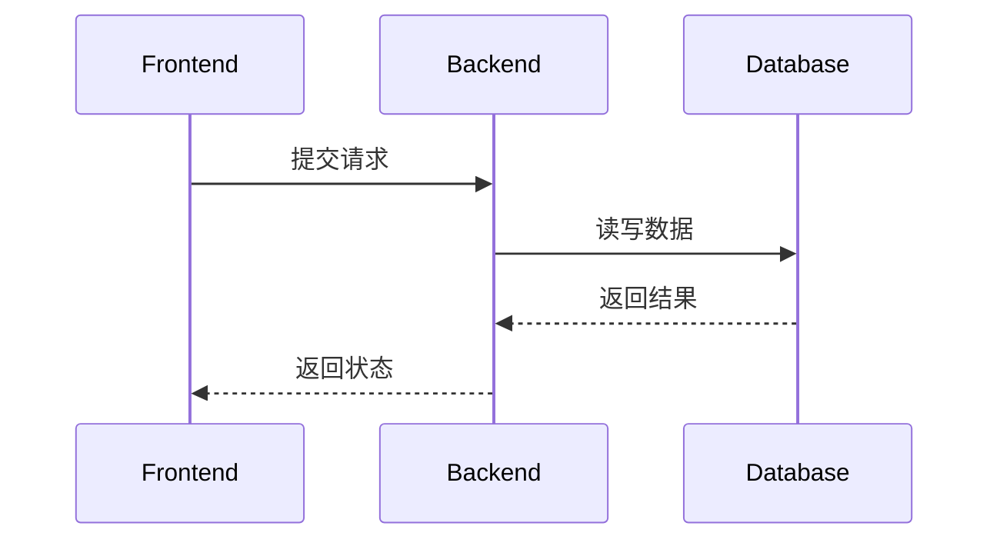

# 研发评审稿模板

> `pm-prd-tech-analysis` skill 的产出格式。**研发一眼看清楚**业务改动点 / 模块影响 / 接口数据影响 / 工作量级别。

````markdown
# <需求名> 研发评审稿

## 1. 需求摘要
- 一句话：
- 本期范围：
- 非本期范围：
- 关键依据：<引用 PRD §X / 知识库路径>

## 2. 业务改动点与工作量判断

| 业务改动点 | 用户/业务影响 | 研发改动范围 | 工作量 | 依据 / 待确认 |
|---|---|---|---|---|
| | | 前端/后端/数据/配置/测试 | S/M/L | |

## 3. 模块影响

| 模块 | 改动类型 | 改动说明 | 风险 |
|---|---|---|---|
| 待确认 | 新增/修改/删除 | | |

## 4. 接口影响

| 接口 | 改动 | 入参 | 出参 | 兼容策略 |
|---|---|---|---|---|
| 待确认 | 新增/修改/删除 | | | |



## 5. 数据影响
- 新增字段 / 表：
- 状态枚举：
- 数据迁移：
- 历史数据兼容：
- 数据口径变化：

## 6. 前后端拆分
- **前端**：
- **后端**：
- **数据 / 配置**：
- **测试**：
- **发布 / 灰度**：

## 7. 工期与工作量评估

| 工作项 | 复杂度 | 依赖 | 备注 |
|---|---|---|---|
| | S/M/L | | |

## 8. 联调与验收
- 联调路径：
- 关键用例：
- 回归范围：

## 9. 风险与待确认
- 风险：
- 待确认问题：

## 10. TODO

| 事项 | 原因 | 建议跟进人 |
|---|---|---|
| | | 研发 / PM / 测试 / 运营 |
````

## §评审口径

- **S**：局部改动，无新增复杂状态或兼容成本（半天内能上线的级别）
- **M**：跨 2-3 个模块，有接口 / 数据 / 灰度配合（1-3 天）
- **L**：跨多系统、有数据迁移 / 兼容老链路 / 灰度回滚 / 多端联动（一周以上）

工作量判断必须给**依据**：基于哪几个改动点累加得出的，依据来自 PRD §X / 代码探查 / 知识库 §Y。

## §代码探查准则

读代码不是为了"实现 PRD"，是为了**确认 PRD 提到的对象在代码里存在 / 当前形态是什么**：

- PRD 说"在订单状态机加 'pending_pix' 状态" → 找当前订单状态机文件，确认现有状态枚举有哪些
- PRD 说"复用现有 Pix 收款码组件" → 找 `components/<scope>/<name>/`，确认组件存在 + 能复用
- PRD 说"扩展 /api/orders 接口的入参" → 找接口定义，确认现有入参 / 验证规则

读到的内容写进**第 4 节接口影响**或**第 3 节模块影响**的"改动说明"，**禁止**自创不存在的接口名 / 字段。
